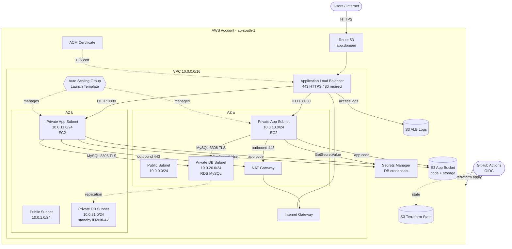

# AWS Architecture

GitHub renders this diagram automatically. To export a PNG for submission, paste it into
https://mermaid.live and download, or redraw it in draw.io and save as `architecture.png` here.

## Traffic flow

1. A user opens `https://app.<domain>`. Route 53 resolves it to the ALB.
2. The ALB terminates TLS with the ACM certificate. Port 80 only returns a 301 redirect to HTTPS.
3. The ALB forwards to healthy EC2 instances on port 8080 in the private app subnets (2 AZs).
4. Instances fetch DB credentials from Secrets Manager and connect to RDS MySQL over TLS.
5. The ALB writes access logs to the logs bucket.
6. Instances have no public IPs. Outbound traffic (packages, AWS APIs) goes through the NAT Gateway.

## Security groups

| SG | Inbound | Outbound |
|---|---|---|
| alb-sg | 443, 80 from 0.0.0.0/0 | 8080 to app-sg |
| app-sg | 8080 from alb-sg | 443 to 0.0.0.0/0, 3306 to rds-sg |
| rds-sg | 3306 from app-sg | none |
